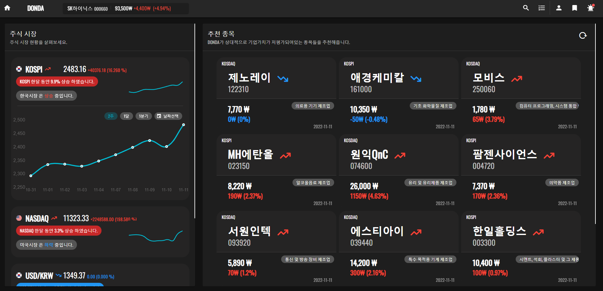

<div align=center>
  
</div>

<br/>
<br/>
<br/>
<div style="font-size:500%" align=center>
  🛠 Skills 
</div>


<div>
  <div align=center>
    
     
     
     
           
  </div>

  <br>

  <div align=center>    
    
    
    
    
    
    
    
               
  </div>
</div>


<br/>
<br/>
<br/>
<div style="font-size:500%" align=center>
  🗂 Structure 
</div>
  
 <!-- 

 <!--  -->
  
```bash
📦src
 ┣ 📂@types
 ┃ ┣ 📂chartjs-plugin-zoom
 ┃ ┃ ┗ 📜index.d.ts  
 ┃ ┗ 📜index.d.ts
 ┣ 📂api
 ┃ ┣ 📜stocks.ts
 ┃ ┗ 📜types.ts
 ┣ 📂assets
 ┃ ┣ 📜koreaflag.png
 ┃ ┣ 📜logo.png
 ┃ ┣ 📜logo.svg
 ┃ ┣ 📜readme-chart1.png
 ┃ ┣ 📜readme-chart2.png
 ┃ ┣ 📜readme-chart3.png
 ┃ ┗ 📜usaflag.png
 ┣ 📂mixins
 ┃ ┣ 📜DiviceMixin.vue
 ┃ ┣ 📜StockStoreMixin.vue
 ┃ ┣ 📜StoreMixin.vue
 ┃ ┣ 📜tools.ts
 ┃ ┗ 📜UserStoreMixin.vue
 ┣ 📂models
 ┃ ┣ 📜app.ts
 ┃ ┣ 📜interest.ts
 ┃ ┣ 📜market.ts
 ┃ ┣ 📜payload.ts
 ┃ ┣ 📜stock.ts
 ┃ ┗ 📜user.ts
 ┣ 📂plugins
 ┃ ┣ 📜directive.ts
 ┃ ┗ 📜vuetify.ts
 ┣ 📂routes
 ┃ ┗ 📜index.js
 ┣ 📂scss
 ┃ ┗ 📜variables.scss
 ┣ 📂store
 ┃ ┣ 📜index.ts
 ┃ ┣ 📜InterestStore.ts
 ┃ ┣ 📜MarketStore.ts
 ┃ ┣ 📜payload.ts
 ┃ ┣ 📜StockStore.ts
 ┃ ┣ 📜UserStore.ts
 ┃ ┗ 📜utils.ts
 ┣ 📂v2
 ┃ ┣ 📂components
 ┃ ┃ ┣ 📂detail
 ┃ ┃ ┃ ┣ 📂finance
 ┃ ┃ ┃ ┃ ┣ 📜FinanceContentFactory.vue
 ┃ ┃ ┃ ┃ ┣ 📜InformationFactory.vue
 ┃ ┃ ┃ ┃ ┣ 📜StockFinance.vue
 ┃ ┃ ┃ ┃ ┣ 📜StockFinanceBarChart.vue
 ┃ ┃ ┃ ┃ ┗ 📜StockFinanceLineChart.vue
 ┃ ┃ ┃ ┣ 📂indicator
 ┃ ┃ ┃ ┃ ┣ 📜IndicatorContentFactory.vue
 ┃ ┃ ┃ ┃ ┣ 📜StockIndicator.vue
 ┃ ┃ ┃ ┃ ┣ 📜StockIndicatorBarChart.vue
 ┃ ┃ ┃ ┃ ┣ 📜StockIndicatorChart.vue
 ┃ ┃ ┃ ┃ ┣ 📜StockIndicatorDetail.vue
 ┃ ┃ ┃ ┃ ┣ 📜StockIndicatorLineChart.vue
 ┃ ┃ ┃ ┃ ┗ 📜StockPolarAreaChart.vue
 ┃ ┃ ┃ ┣ 📂similar
 ┃ ┃ ┃ ┃ ┣ 📜NewsContentsFactory.vue
 ┃ ┃ ┃ ┃ ┣ 📜StockNews.vue
 ┃ ┃ ┃ ┃ ┣ 📜StockSimiarContent.vue
 ┃ ┃ ┃ ┃ ┗ 📜StockSimilar.vue
 ┃ ┃ ┃ ┣ 📂stock
 ┃ ┃ ┃ ┃ ┣ 📜Stock.vue
 ┃ ┃ ┃ ┃ ┣ 📜StockBigChart.vue
 ┃ ┃ ┃ ┃ ┗ 📜StockInfo.vue
 ┃ ┃ ┃ ┗ 📂valuation
 ┃ ┃ ┃ ┃ ┣ 📜StockScore.vue
 ┃ ┃ ┃ ┃ ┣ 📜StockScoreBarChart.vue
 ┃ ┃ ┃ ┃ ┣ 📜StockValuation.vue
 ┃ ┃ ┃ ┃ ┣ 📜StockValuationChart.vue
 ┃ ┃ ┃ ┃ ┣ 📜StockValuationSingleChart.vue
 ┃ ┃ ┃ ┃ ┗ 📜ValuationBackgroundChart.vue
 ┃ ┃ ┣ 📂home
 ┃ ┃ ┃ ┣ 📜HomeNav.vue
 ┃ ┃ ┃ ┣ 📜MarketChart.vue
 ┃ ┃ ┃ ┣ 📜MarketTrend.vue
 ┃ ┃ ┃ ┣ 📜MarketTrendFactory.vue
 ┃ ┃ ┃ ┣ 📜MarketTrendLayout.vue
 ┃ ┃ ┃ ┣ 📜StockRecommend.vue
 ┃ ┃ ┃ ┗ 📜StockRecommendContent.vue
 ┃ ┃ ┣ 📂rank
 ┃ ┃ ┃ ┣ 📜RankComponent.vue
 ┃ ┃ ┃ ┗ 📜RankContents.vue
 ┃ ┃ ┗ 📂vuetify
 ┃ ┃ ┃ ┣ 📜BtnBadge.vue
 ┃ ┃ ┃ ┣ 📜BtnTooltip.vue
 ┃ ┃ ┃ ┗ 📜ProgressCircular.vue
 ┃ ┗ 📂pages
 ┃ ┃ ┣ 📜Detail.vue
 ┃ ┃ ┣ 📜Footer.vue
 ┃ ┃ ┣ 📜Home.vue
 ┃ ┃ ┣ 📜HomeCarousel.vue
 ┃ ┃ ┣ 📜NavBar.vue
 ┃ ┃ ┣ 📜NavBarMenus.vue
 ┃ ┃ ┣ 📜RankV2.vue
 ┃ ┃ ┣ 📜SearchBar.vue
 ┃ ┃ ┣ 📜SideBar.vue
 ┃ ┃ ┗ 📜SnackBar.vue
 ┣ 📜App.vue
 ┣ 📜main.ts
 ┣ 📜shims-tsx.d.ts
 ┣ 📜shims-vue.d.ts
 ┗ 📜shims-vuetify.d.ts

📂@types      - ts로 재정의한 npm 라이브러리를 담고 있습니다.
📂api         - api url과 요청 타입을 담고있습니다.
📂assets      - 외부 파일을 담습니다.
📂components  - 페이지에 그려질 컴포넌트들을 담고 있습니다. 
📂mixins      - Vue의 mixins과 각종 유틸 함수들을 담고 있습니다.      
📂models      - 각종 데이터 모델을 정의합니다.
📂pages       - 페이지를 담고 있습니다.
📂plugins     - Vue의 plugins을 정의합니다.
📂routes      - 라우트 설정을 정의합니다.
📂store       - vuex store들을 정의합니다.

📂components
 ┣ 📂detail    - 디테일 페이지에 필요한 컴포넌트들을 담고 있습니다.
 ┣ 📂home      - 홈 페이지에 필요한 컴포넌트들을 담고 있습니다.
 ┣ 📂rank      - 랭크 페이지에 필요한 컴포넌트들을 담고 있습니다.

```


<br/>
<br/>
<br/>
<div style="font-size:500%" align=center>
   ✨Features
</div>
<br/>
<br/>
<br/>

<div style="font-size:200%">
  # CLASS COMPONENT
</div>
<br/>

**돈다** 의 ***Vue.js***는 ***Class Component*** 방식으로 작성되었습니다.  <br/><br/>


**📦src/v2/📂components/📂detail/📂stock/📜Stock.vue**
```js
@Component({
  components: {
    StockBigChart,
  }
})
export default class Stock extends mixins(StockStoreMixin, DiviceMixin) { 
  ...
}
```

***Class Component***로 작성한 이유는 다음과 같습니다.
> *vuetify*를 사용하기 용이하기위해 *vue2*버전을 사용했습니다.

> *vue2*버전에서 *Typescript* 사용이 용이합니다. <br/>

> 미리 작성한 클래스 설계도를 따라가기 용이합니다. <br/>

<br/>

하지만, *vuetify*가 3버전에 들어섬에 따라, *vue3*버전또한 *vuetify*에 호환이 되기 때문에,  *vue3* *vuetify3*을 기반으로한 ***composition API***방식으로 작성하고, 모바일 기준으로 레이아웃이 개편된[donda-3](https://github.com/codma1123/DONDA-Vue3)를 선보일 예정입니다.


<br/>
<br/>


<div style="font-size:200%">
  # API REQUEST
</div>
<br/>


**돈다** 에서 API 요청은 Vuex 스토어를 통해 이루어집니다. <br/>
*payload*를 통해 request를 요청하고 *state*를 설정하는 과정을 살펴봅시다.
<br />
<br />

**📦src/📂store/📜StockStoreV2.ts**
```js
@Action
public async callRequest(payload: AsyncPayload): Promise<void> {
  
  const { state, asyncCallback, compute } = payload
  
  this.context.commit('loading', state) 
  try {
    const res = await asyncCallback()      
    const data = compute(res)

    this.context.commit('success', { state: state, data })

  } catch (error) {
    this.context.commit('error', { state, error })
  }
}
```
<br />


```js
  const { state, asyncCallback, compute } = payload
```
먼저 함수 인자 payload는 위와 같이 구조분해할당 됩니다. <br/>
> ***state**** : 변경할 store의 상태입니다.<br>
> ***aynscCallback**** : 요청할 비동기 함수입니다. </br>
> ***compute**** : 받아온 비동기 함수에 대한 추가적인 연산을 진행하는 함수입니다.


<br/>
<br/>

<span style="font-size:180%">
  1. Loading
</span>
<br/>
<br/>

```js
this.context.commit('loading', state)
```
```js
@Mutation
public loading(state: string) {    
  this[state].loading = true        
}
```

<br/>

***loading Mutation***을 호출합니다. ***loading Mutation***은 해당 *state*의 *loading* 상태를 ***true***로 만듭니다. <br/>
*state*는 다음 ***initial*** 함수에의해 초기화되어 있는 상태입니다.

```js
export const initialState = <T>(initial?: T): StoreState<T> => ({
  data: initial || null,
  error: null,
  loading: false
})
```
<br/>

*state*의 *loading*이 ***true***인 상태에서는, 해당 *state*를 사용하는 컴포넌트들이 로딩 화면을 띄우게 됩니다.

<br/>
<br/>

<span style="font-size:180%">
  2. Success
</span>
<br/>
<br/>

```js
const res = await asyncCallback()      
const data = compute(res)

this.context.commit('success', { state: state, data })
```
```js
@Mutation
public success({ state, data }: {state: string, data: unknown}) {
  this[state].data = data 
  this[state].loading = false
}
```
<br/>

*asyncCallback*을 호출하고, 받아온 response를 *compute*하여 새로운 data로 추출한 후, ***success Mutation***을 호출합니다. 
***success Mutation***은 해당 *state*의 *data*를 할당하고, *loading* 상태를 ***false***로 만듭니다. <br /><br />
*state*의 *loading*이 ***false***인 상태에서는, 해당 *state*를 사용하는 컴포넌트들이 로딩을 마치고, 데이터를 화면에 표시합니다

<br/>
<br/>

<span style="font-size:180%">
  3. Error
</span>
<br/>
<br/>

```js
catch (error) {
  this.context.commit('error', { state, error })
}
```
```js
@Mutation
public error({ state, error }: {state: string, error: unknown}) {
  this[state].error = error
  this[state].loading = false
}
```

<br/>

요청중 에러가 발생하였다면, ***error Mutation***을 호출합니다. ***error Mutation***은 해당 *state*에 *error*를 할당하고, *loading* 상태를 ***false***로 만듭니다.

<br/>
<br/>
<br/>


<div style="font-size:200%">
  # Chart
</div>
<br/>

**돈다** 에서 주가관련 데이터의 차트들은 ***chart.js*** 라이브러리를 통해 구현됩니다.

<div align=center>
  
</div>
<br/>
<div align=center>
  
</div>
<br/>
<div align=center>
  
</div>
<br/>

```js
@Component({
  extends: Radar,
  mixins: [reactiveProp],
})
export default class StockIndicatorChart extends StockStoreMixin {
  //...
}
```
<br/>


